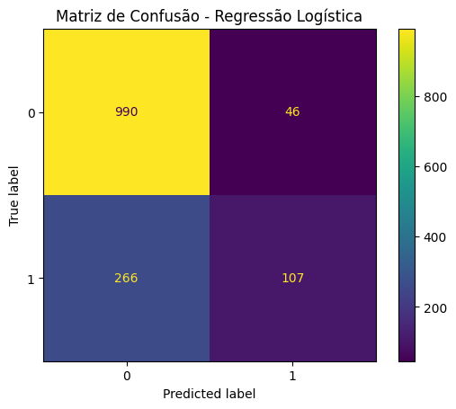
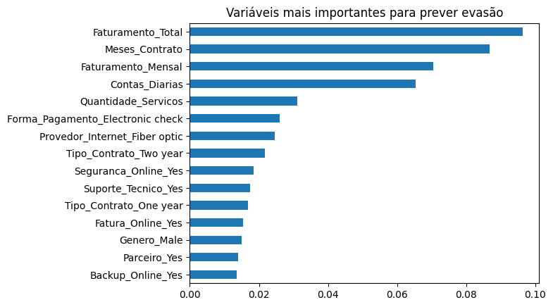

📊 TelecomX — Previsão de Evasão de Clientes

Projeto de **Machine Learning** desenvolvido para prever a evasão de clientes (Churn) em uma empresa fictícia de telecomunicações.

Este projeto faz parte do **Challenge de Data Science da Alura + Oracle ONE** e tem como objetivo aplicar técnicas de análise de dados e modelagem preditiva para identificar clientes com maior probabilidade de cancelar seus serviços.

---

# 🎯 Objetivo do Projeto

Empresas de telecomunicações enfrentam alta concorrência e frequentemente perdem clientes para outras operadoras.

O objetivo deste projeto é:

- Identificar padrões de comportamento dos clientes
- Construir modelos de Machine Learning para prever evasão
- Identificar variáveis mais importantes para o churn

Essas análises podem ajudar empresas a criar **estratégias de retenção de clientes**.

---

# 🧠 Modelos Utilizados

Foram utilizados dois modelos de classificação:

- Regressão Logística
- Random Forest

Esses modelos são amplamente utilizados em problemas de classificação binária como a previsão de churn.

---

# ⚙️ Pipeline do Projeto

O fluxo do projeto seguiu as seguintes etapas:

1. Importação dos dados tratados  
2. Preparação dos dados para Machine Learning  
3. Transformação de variáveis categóricas  
4. Separação entre treino e teste  
5. Treinamento dos modelos  
6. Avaliação de desempenho  
7. Análise da importância das variáveis  

---

# 📊 Avaliação dos Modelos

As métricas utilizadas para avaliar o desempenho foram:

- Accuracy
- Precision
- Recall
- F1-score
- Matriz de confusão

---

# 📈 Matriz de Confusão



---

# 🔎 Variáveis Mais Importantes

A análise de importância das variáveis mostrou que alguns fatores possuem maior influência na evasão de clientes.



---

# 💡 Principais Insights

Alguns fatores associados ao churn incluem:

- Clientes com **contratos mensais** possuem maior probabilidade de cancelar
- Clientes com **menos tempo de permanência** tendem a cancelar mais
- A ausência de **suporte técnico ou serviços adicionais** aumenta o risco de evasão
- Clientes com **faturamento mais alto** apresentam maior chance de churn

---

# 🛠️ Tecnologias Utilizadas

- Python
- Pandas
- NumPy
- Scikit-learn
- Matplotlib
- Seaborn
- Jupyter Notebook

---

# 📂 Estrutura do Projeto  
TelecomX-Churn-Prediction  
│
├── data  
│ └── telecomx_tratado.csv  
│
├── notebooks  
│ └── TelecomX_Modeling.ipynb  
│
├── images  
│ ├── confusion_matrix.png  
│ └── feature_importance.png  
│
├── requirements.txt  
└── README.md  

---

# 🚀 Como Executar o Projeto

```bash
git clone https://github.com/rochaapdrr/TelecomX-Churn-Prediction

cd TelecomX-Churn-Prediction

pip install -r requirements.txt
```
-------------------------------
👨‍💻 Autor

Pedro Oliveira Rocha

Estudante de ADS focado em análise de dados e machine learning.
